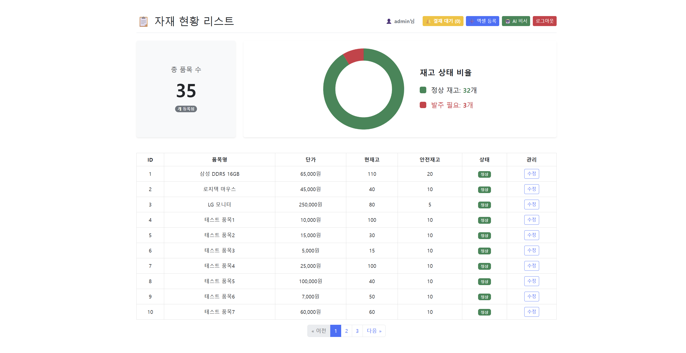
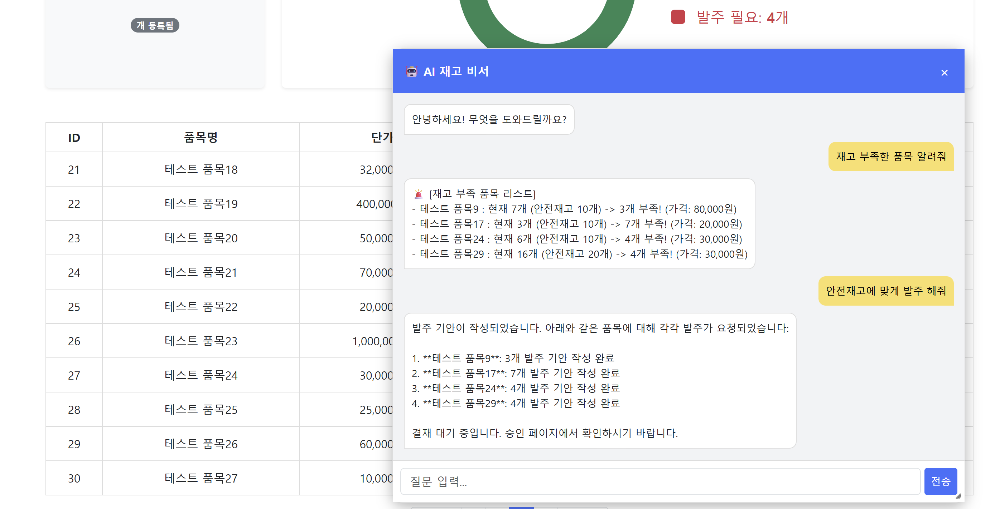
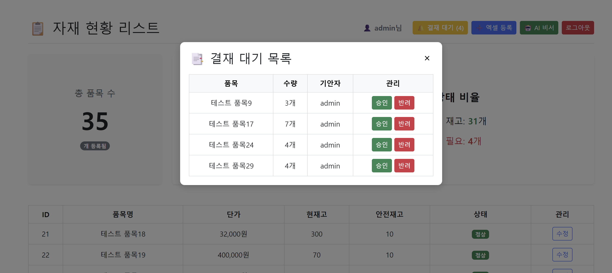

# 🤖 AI-Powered Smart ERP (지능형 자재 관리 시스템)

> **Spring AI와 RAG(검색 증강 생성) 기술을 활용하여, 환각(Hallucination) 없는 정확한 재고 관리와 "Human-in-the-Loop" 결재 프로세스를 구현한 지능형 ERP 시스템입니다.**

 
 


---

## 📅 프로젝트 개요
기존 ERP 시스템은 사용법이 복잡하고 데이터 조회가 번거롭다는 단점이 있습니다. 본 프로젝트는 **생성형 AI(LLM)**를 도입하여 채팅만으로 재고 파악과 발주 업무를 수행할 수 있도록 개선했습니다.

특히 AI가 거짓 정보를 말하는 **'환각 현상'**을 해결하기 위해 **RAG(벡터 검색)**와 **Function Calling(실시간 DB 조회)**을 결합한 하이브리드 아키텍처를 설계했으며, AI의 오작동을 방지하기 위해 **"기안(AI) -> 승인(관리자)"** 프로세스를 구축하여 데이터 무결성을 확보했습니다.

---

## ✨ 핵심 기능 (Key Features)

### 1. 🤖 AI 자재 비서 (RAG + Function Calling)
- **하이브리드 정보 제공**
  - 변하지 않는 정보(상품 설명, 회사 정책) → **벡터 DB(RAG)** 조회
  - 실시간 변동 정보(현재고, 가격) → **Function Calling + 실제 DB 조회**
- **스마트 발주**
  - "재고 부족한 거 발주 넣어줘"라고 입력하면
  - AI가 부족분 계산 → 자동으로 **결재 기안(Draft) 생성**

---

### 2. ✅ Human-in-the-Loop 결재 시스템
- AI가 **DB를 직접 수정하지 않도록 설계**
- 역할 분리
  - **AI** → 발주 ‘기안(Draft)’ 작성 (결재 대기 상태)
  - **관리자(Admin)** → 대기 목록 확인 후 승인 버튼 클릭 시 실제 재고 반영

---

### 3. 🛡️ 데이터 무결성 및 보안
- **동시성 제어**
  - `@Version` 기반 낙관적 락 적용
  - 동시 수정 충돌 방지
- **감사 로그(Auditing)**
  - BaseEntity + Spring Security 연동
  - 누가, 언제 수정/생성했는지 자동 기록
- **권한 관리(RBAC)**
  - 일반 사용자(User) / 관리자(Admin)
  - URL 및 버튼 레벨까지 권한 철저 분리

---

### 4. 📊 대시보드 및 편의 기능
- **실시간 시각화**
  - Chart.js로 정상 재고 / 부족 재고 비율 도넛 차트 제공
- **엑셀 연동**
  - Apache POI 기반 대량 자재 업로드 지원
  - 업로드 시 유효성 검사 적용

---

## 🛠️ 기술적 챌린지 & 해결 과정 (Troubleshooting)

### 🚀 Issue 1: AI 데이터 중복 및 환각 문제
- **문제**
  - 상품 정보 수정 / 엑셀 재업로드 시 벡터 DB에 데이터가 중복 저장
  - AI가 이전 가격과 현재 가격 혼동
- **해결**
  - `UUID.nameUUIDFromBytes(productId)` 적용
  - 상품 ID 기반 동일 UUID 생성 → 중복 저장 대신 **Update 처리**
  - 데이터 일관성 확보

---

### ⚡ Issue 2: 동시성 이슈 (Concurrency)
- **문제**
  - 두 명의 관리자가 동시에 결재 승인 시 재고 수량 꼬일 가능성
- **해결**
  - JPA `@Version` 낙관적 락 적용
  - 충돌 발생 시 `ObjectOptimisticLockingFailureException` 처리
  - 글로벌 예외 처리기에서
    - 사용자 안내: `"다른 관리자가 수정했습니다"`

---

### 🐢 Issue 3: N+1 문제 최적화
- **문제**
  - 결재 목록 조회 시 각 결재 건마다 상품 쿼리 추가 발생
  - 성능 저하
- **해결**
  - JPQL `JOIN FETCH` 적용
  - 한 번의 쿼리로 결재 + 상품 정보 조회

---

## 💻 기술 스택 (Tech Stack)

| 구분 | 기술 |
|------|------|
| **Language** | Java 17 |
| **Framework** | Spring Boot 3.2.5, Spring Security |
| **AI / LLM** | Spring AI (0.8.1), OpenAI API |
| **Database** | PostgreSQL 16 (Relation + pgvector) |
| **ORM** | Spring Data JPA |
| **Frontend** | Thymeleaf, Bootstrap 5, jQuery, Chart.js |
| **Tools** | Gradle, Apache POI (Excel) |

---

## 📸 실행 화면 (Screenshots)

| 메인 대시보드 (차트 & 리스트) |
| :--: |
|  |
| *실시간 재고 현황 및 관리자 기능* |

| AI 비서 (재고 조회 & 기안) | 결재 승인 (관리자 전용) |
| :--: | :--: |
|  |  |
| *RAG 기반 답변 및 발주 요청* | *기안된 문서 승인/반려 처리* |

---

## 🏗️ 시스템 아키텍처 (System Architecture)
```mermaid
graph TD
    User["사용자 (Web/Mobile)"] -->|HTTP Request| Security["Spring Security Filter"]
    
    subgraph "Backend (Spring Boot)"
        Security --> Controller[Controller Layer]
        Controller --> Service[Service Layer]
        
        %% 일반 업무 로직
        Service --> JPA[JPA Repository]
        JPA --> DB[("PostgreSQL")]
        
        %% AI 로직
        Controller --> AIService[AI Service]
        AIService -->|1. 유사 문서 검색| VectorStore[("PgVector (RAG Memory)")]
        AIService -->|2. 프롬프트 생성| LLM[OpenAI Model]
        
        %% Function Calling 흐름
        LLM -->|3. 도구 호출 요청| AIService
        AIService -->|4. 실시간 데이터 조회| Service
        Service -->|5. 최신 재고/가격 반환| AIService
        AIService -->|6. 최종 답변 생성| LLM
    end
    
    subgraph "Data Storage"
        DB
        VectorStore
    end
